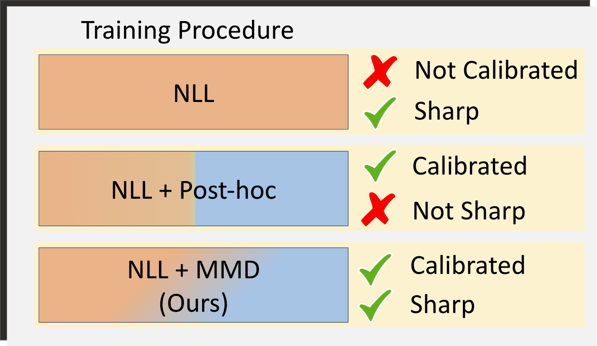
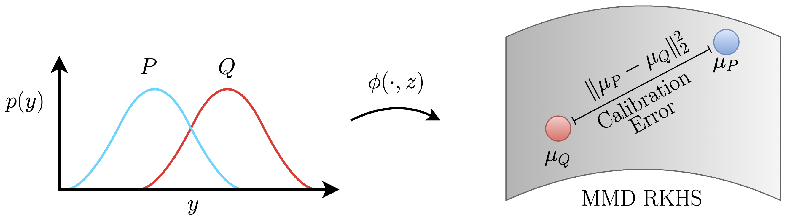

# Calibration by Distribution Matching: Trainable Kernel Calibration Metrics

This is the official implementation of the NeurIPS 2023 paper "[Calibration by Distribution Matching: Trainable Kernel Calibration Metrics](https://arxiv.org/abs/2310.20211)".

Authors: [Charles Marx](https://charliemarx.github.io/)\*, [Sofian Zalouk](https://szalouk.github.io/)\*, [Stefano Ermon](https://cs.stanford.edu/~ermon/)

\* Equal contribution.

---

## Calibration as Distribution Matching

We compare the forecasts and the ground-truth conditional label distributions using the Maximum Mean Discrepancy (MMD):

$$ \mathrm{MMD}^2(\mathcal{F}, P, Q) = || \mathbb{E}_P  [ \phi(Y, Z) ] - \mathbb{E}_Q [ \phi(\widehat{Y}, Z)] ||^2 _{\mathcal{H}}$$ 

By modifying the variables in the MMD metric, we can express many popular calibration constraints. The plug-in estimator for MMD can be used as a calibration regularizer, yielding a combined training objective:

$$ \min_{\theta \in \Theta} \sum_{i \in D_b} - \log q_{Y \mid x_i ; \theta}(y_i) + \lambda \cdot \widehat{\mathrm{MMD}}^2(\mathcal{F},D_b, Q_\theta) $$

This allows us to jointly optimize calibration and sharpness.
<p align="center">

</p>

## A General Recipe for Decision Calibration

MMD measures Decision Calibration Error when we define the feature map $\phi(y)$ that computes the losses of all actions. Low Decision Calibration Error gives ***no-regret decision-making*** and ***accurate loss estimation***. Using the kernel trick, we can enforce decision calibration even when the action space or set of loss functions is infinite.

<p align="center">

</p>

## Setup

Clone the respository

```
git clone https://github.com/kernel-calibration/kernel-calibration.git
```

Create the conda environment

```
conda create -n "kcalibration" python=3.10.8 ipython
conda activate kcalibration
```

Install packages

``` 
pip install -r requirements.txt
```

## Usage

### Classification

All experimental settings can be found under `configs/experiments/classification_*`. The available classification datasets are `wdbc`, `adult`, `heart-disease`, `online-shoppers` and `dry-bean`.

To train a model using our mixed loss (`MMD + NLL`), run

```
python train.py -m experiment=classification_mixed trainer.gpus=NUM_GPUS datamodule.dataset_name=DATASET_NAME
```

To train a model using Cross-Entropy loss, run

```
python train.py -m experiment=classification_nll trainer.gpus=NUM_GPUS datamodule.dataset_name=DATASET_NAME
```

### Regression

All experimental settings can be found under `configs/experiments/regression_*`. The available regression datasets are `blog`, `boston`, `concrete`, `crime`, `energy-efficiency`, `fb-comment1`, `fb-comment2`, `forest-fires`, `kin8nm`, `medical-expenditure`, `mpg`, `naval`, `power-plant`, `protein`, `superconductivity`, `wine`, `yacht`, `county_crop_wheat`, `crop_rice`, `crop_barley`, `crop_maize`, `crop_millet`, `crop_wheat`, `crop_sorghum`.

To train a regression model using our mixed loss (`MMD + NLL`), run

```
python train.py -m experiment=regression_mixed trainer.gpus=NUM_GPUS datamodule.dataset_name=DATASET_NAME
```

To train a model using Negative Log-Likelihood, run

```
python train.py -m experiment=regression_nll trainer.gpus=NUM_GPUS datamodule.dataset_name=DATASET_NAME
```

## Hyperparameter Tuning
For hyperparameter tuning, all config files can be found under `configs/hparam_search`. You must include following additional argument:

```
python train.py -m ... hparams_search=HPARAM_CONFIG_FILE
```

## References
If you find our work or datasets useful, please cite the following paper:

```
@inproceedings{marx2023calibration,
  title={Calibration by Distribution Matching: Trainable Kernel Calibration Metrics},
  author={Marx, Charles and Zalouk, Sofian and Ermon, Stefano},
  year={2023},
  month={December},
  abbr={NeurIPS 2023},
  booktitle={Neural Information Processing Systems}
}
```

## Acknowledgements
This repository was inspired by [lightning-hydra-template](https://github.com/ashleve/lightning-hydra-template).
